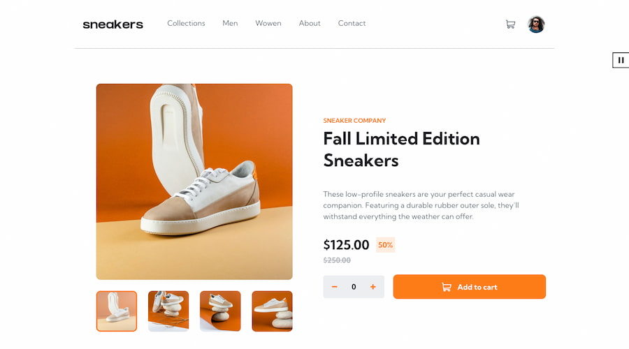

# Frontend Mentor - E-commerce product page solution

This is a solution to the [E-commerce product page challenge on Frontend Mentor](https://www.frontendmentor.io/challenges/ecommerce-product-page-UPsZ9MJp6). Frontend Mentor challenges help you improve your coding skills by building realistic projects.

## Table of contents

- [Overview](#overview)
  - [The challenge](#the-challenge)
  - [Screenshot](#screenshot)
  - [Links](#links)
- [My process](#my-process)
  - [Built with](#built-with)
  - [The Lightbox](#the-lightbox)
- [Author](#author)

## Overview

### The challenge

Users should be able to:

- View the optimal layout for the site depending on their device's screen size
- See hover states for all interactive elements on the page

### Screenshot



### Links

- [Solution URL]()
- [Live Site URL](https://ecommerce-product-nazif.netlify.app/)

## My process

### Built with

- Semantic HTML5 markup
- CSS custom properties
- Flexbox
- CSS Grid
- Theme
- Mobile-first workflow
- [React](https://reactjs.org/) - JS library
- [Stitches](https://stitches.dev/) - For styles

### The Lightbox

Using the Provider patern I increased code reusability. The nav menu drawer, the cart popup,
and the product lightbox use this Provider as a foundation.

```js
const LightboxContext = createContext();

export const useLightboxContext = () => {
  const lightboxState = useContext(LightboxContext);
  if (!lightboxState) {
    throw new Error('useLightboxContext must be used within the Lightbox.Root');
  }
  return lightboxState;
};

export const Root = ({ children, delay = 300 }) => {
  const [isOpen, setIsOpen] = useState(false);
  const [closing, setClosing] = useState(false);

  const open = () => {
    document.body.style.overflow = 'hidden';
    setIsOpen(true);
  };
  const close = () => {
    document.body.style.overflow = 'auto';
    setClosing(true);
    setTimeout(() => {
      setIsOpen(false);
      setClosing(false);
    }, delay);
  };

  return (
    <LightboxContext.Provider value={{ isOpen, open, close, closing }}>
      {children}
    </LightboxContext.Provider>
  );
};

export const Overlay = (props) => {
  const { isOpen, close } = useLightboxContext();
  return isOpen && <StyledOverlay onClick={close} {...props} />;
};

export const Trigger = ({ children, as, css = {}, ...otherProps }) => {
  const { open } = useLightboxContext();

  return (
    <StyledIconButton as={as} onClick={open} css={css} {...otherProps}>
      {children}
    </StyledIconButton>
  );
};

export const Close = ({ children, as, css = {} }) => {
  const { close, isOpen } = useLightboxContext();

  return (
    isOpen && (
      <StyledIconButton
        as={as}
        onClick={close}
        css={{
          color: 'white',
          transform: 'scale(1.5)',

          svg: {
            bgC: 'transparent',
          },
          '& path': {
            fill: 'white',
            transition: 'fill ease-out 0.3s',
          },

          '&:hover path': {
            fill: '$primary',
          },
          ...css,
        }}
      >
        {children}
      </StyledIconButton>
    )
  );
};

export const Content = ({ children, as, css, ...otherProps }) => {
  const { isOpen } = useLightboxContext();

  return (
    isOpen && (
      <StyledBox as={as} css={{ zIndex: 3, ...css }} {...otherProps}>
        {children}
      </StyledBox>
    )
  );
};
```

## Author

- Website - [nazifbara.com](https://www.nazifbara.com)
- Frontend Mentor - [@nazifbara](https://www.frontendmentor.io/profile/nazifbara)
- Twitter - [@nazifbara](https://www.twitter.com/nazifbara)
