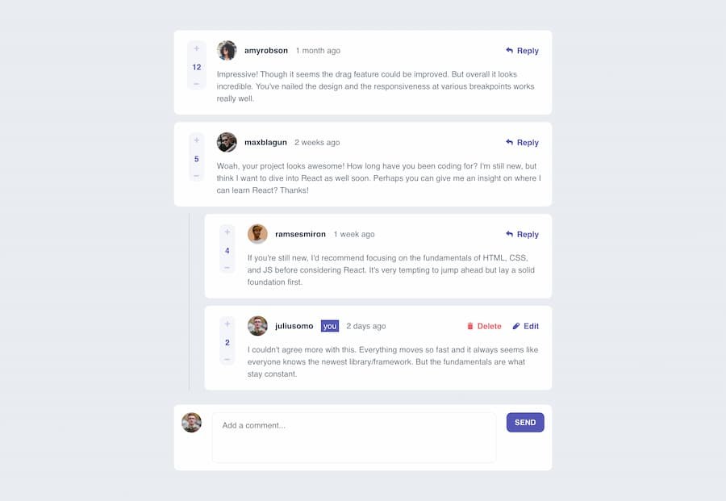

# Frontend Mentor - Interactive comments section solution

This is a solution to the [Interactive comments section challenge on Frontend Mentor](https://www.frontendmentor.io/challenges/interactive-comments-section-iG1RugEG9). Frontend Mentor challenges help you improve your coding skills by building realistic projects.

## Table of contents

- [Overview](#overview)
  - [The challenge](#the-challenge)
  - [Screenshot](#screenshot)
  - [Links](#links)
- [Built with](#built-with)
- [Author](#author)

## Overview

### The challenge

Users should be able to:

- View the optimal layout for the app depending on their device's screen size
- See hover states for all interactive elements on the page
- Create, Read, Update, and Delete comments and replies
- Upvote and downvote comments

### Screenshot

### Links

- [Solution](https://www.frontendmentor.io/solutions/interactive-comments-section-using-svelte-kqGZ6rD7kb)
- [Live site](https://interactive-comments-svelte.netlify.app/)

## Built with

- Semantic HTML5 markup
- CSS custom properties
- Flexbox
- CSS Grid
- Mobile-first workflow
- [Svlete](https://svelte.dev/) - JS library

## Author

- Website - [nazifbara.com](https://www.nazifbara.com)
- Frontend Mentor - [@nazifbara](https://www.frontendmentor.io/profile/nazifbara)
- Twitter - [@nazifbara](https://www.twitter.com/nazifbara)
