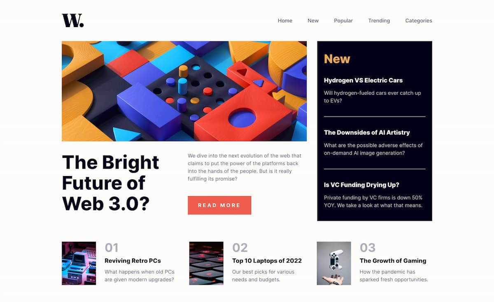

# Frontend Mentor - News homepage solution

This is a solution to the [News homepage challenge on Frontend Mentor](https://www.frontendmentor.io/challenges/news-homepage-H6SWTa1MFl). Frontend Mentor challenges help you improve your coding skills by building realistic projects.

## Table of contents

- [Overview](#overview)
  - [The challenge](#the-challenge)
  - [Screenshot](#screenshot)
  - [Links](#links)
- [Built with](#built-with)
- [Author](#author)

## Overview

### The challenge

Users should be able to:

- View the optimal layout for the interface depending on their device's screen size
- See hover and focus states for all interactive elements on the page
- Toggle the mobile menu

### Screenshot

### Links

- [Solution](https://www.frontendmentor.io/solutions/responsive-news-homepage-using-react-stitches-css-grid-and-flexbox-K5hzYWCoXA)
- [Live Site](https://news-homepage-nazif.netlify.app/)

## Built with

- Semantic HTML5 markup
- CSS custom properties
- Flexbox
- CSS Grid
- Mobile-first workflow
- [React](https://reactjs.org/) - JS library
- [Stitches](https://stitches.dev/) - For styles

## Author

- Website - [nazifbara.com](https://www.nazifbara.com)
- Frontend Mentor - [@nazifbara](https://www.frontendmentor.io/profile/nazifbara)
- Twitter - [@nazifbara](https://www.twitter.com/nazifbara)
