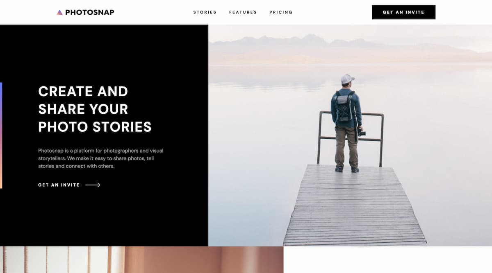

# Frontend Mentor - Photosnap Website solution

This is a solution to the [Photosnap Website challenge on Frontend Mentor](https://www.frontendmentor.io/challenges/photosnap-multipage-website-nMDSrNmNW). Frontend Mentor challenges help you improve your coding skills by building realistic projects.

## Table of contents

- [Overview](#overview)
  - [The challenge](#the-challenge)
  - [Screenshot](#screenshot)
  - [Links](#links)
- [Built with](#built-with)
- [Author](#author)

## Overview

### The challenge

Users should be able to:

- View the optimal layout for each page depending on their device's screen size
- See hover states for all interactive elements throughout the site

### Screenshot

### Links

- [Live Site](https://photosnap-nazif.netlify.com)

## Built with

- [SvelteKit](https://kit.svelte.org/) - JS framework
- Semantic HTML5 markup
- CSS custom properties
- Flexbox
- CSS Grid
- Mobile-first workflow

## Author

- Website - [nazifbara.com](https://www.nazifbara.com)
- Frontend Mentor - [@nazifbara](https://www.frontendmentor.io/profile/nazifbara)
- Twitter - [@nazifbara](https://www.twitter.com/nazifbara)
