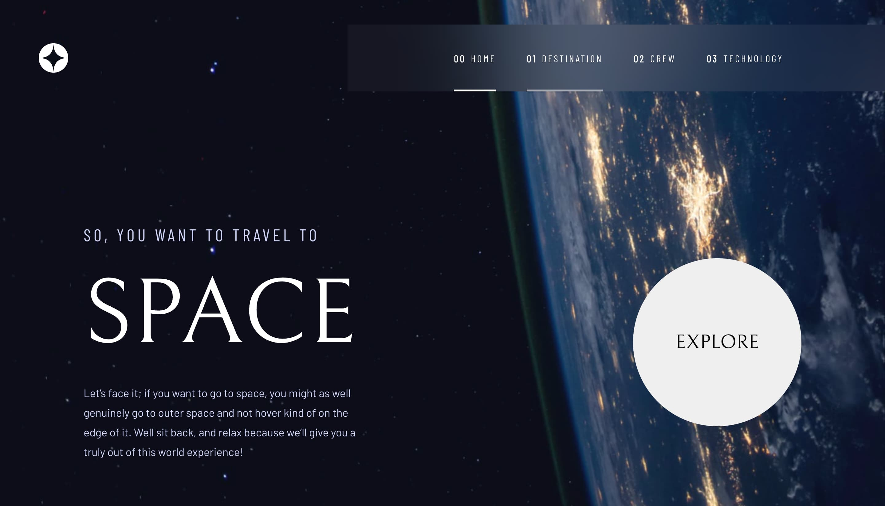

# Space Tourism



Here is my solution for the [frontendmentor](https://www.frontendmentor.io/) challenge called ["Space tourism multi-page website."](https://www.frontendmentor.io/challenges/space-tourism-multipage-website-gRWj1URZ3).

I used React and Material UI.

## Installation

```
git clone https://github.com/nazifbara/space-tourism.git
cd space-tourism
npm start
```

## Hosting

I used GitHub Pages for the hosting. In the package.json file, edit the "homepage" line to match your domain.
