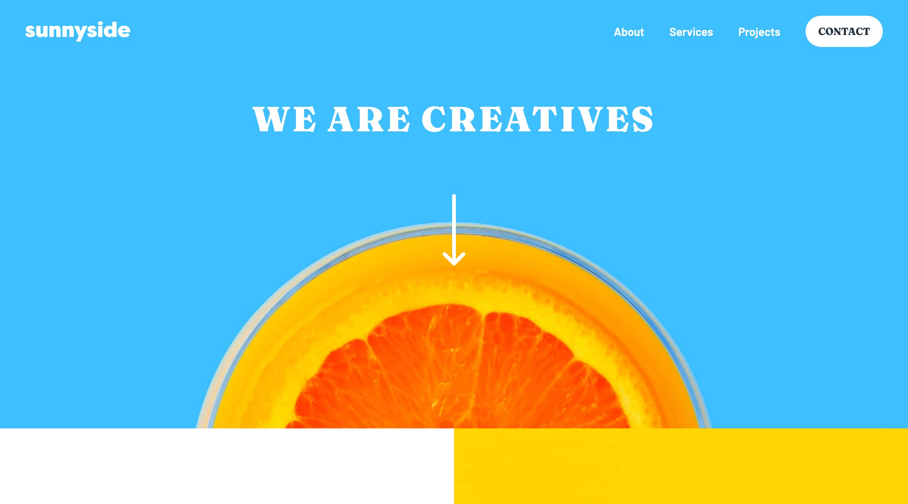

# Frontend Mentor - Sunnyside agency landing page solution

This is a solution to the [Fylo dark theme landing page challenge on Frontend Mentor](https://www.frontendmentor.io/challenges/sunnyside-agency-landing-page-7yVs3B6ef). Frontend Mentor challenges help you improve your coding skills by building realistic projects.

## Table of contents

- [Overview](#overview)
  - [The challenge](#the-challenge)
  - [Screenshot](#screenshot)
  - [Links](#links)
- [My process](#my-process)
  - [Built with](#built-with)
  - [What I learned](#what-i-learned)
- [Author](#author)

## Overview

### The challenge

Users should be able to:

- View the optimal layout for the site depending on their device's screen size
- See hover states for all interactive elements on the page

### Screenshot



### Links

- [Solution URL]()
- [Live Site UR](https://sunnyside-nazif.netlify.app/)

## My process

### Built with

- Semantic HTML5 markup
- CSS custom properties
- Flexbox
- CSS Grid
- Theme
- Mobile-first workflow
- [React](https://reactjs.org/) - JS library
- [Stitches](https://stitches.dev/) - For styles

### What I learned

I learned how to use sub-themes for specific parts of the UI.

```js
// theme
const headerTheme = createTheme('intro-theme', {
  colors: {
    text: 'white',
    textGray: 'white',
    hoverText: 'white',
  },
});

// usage
const Header = () => <StyledHeader className={headerTheme}>...</StyledHeader>;

// theme
const footerTheme = createTheme('footer-theme', {
  colors: {
    text: 'hsl(167, 40%, 24%)',
    hoverText: 'white',
    bg: 'hsl(168, 34%, 67%)',
  },
});

// usage
const Footer = () => (
  <StyledContainer as="footer" className={footerTheme}>
    ...
  </StyledContainer>
);
```

## Author

- Website - [nazifbara.com](https://www.nazifbara.com)
- Frontend Mentor - [@nazifbara](https://www.frontendmentor.io/profile/nazifbara)
- Twitter - [@nazifbara](https://www.twitter.com/nazifbara)
